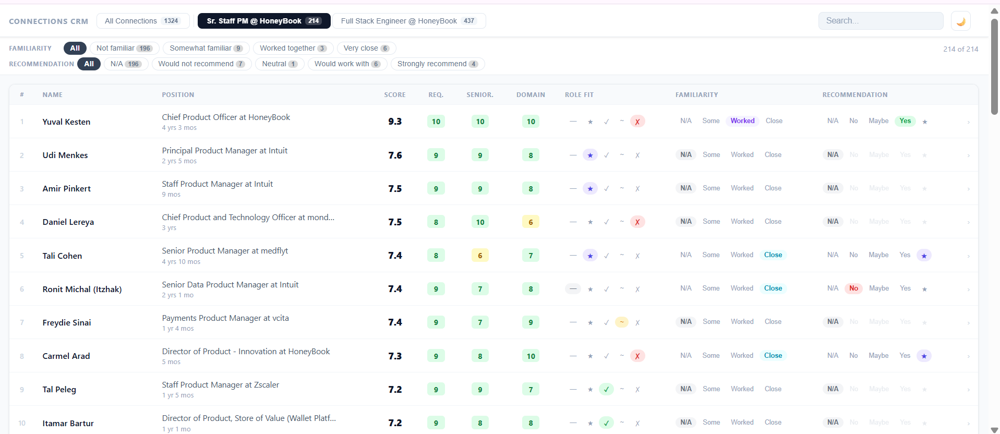

# career-network

The fastest referral bonus you'll ever earn.

You have connections who'd be perfect for that open role. This system finds them, scores them by fit, and shows you a ranked shortlist — so you reach out to the right person and close the referral fast.



---

## How it works

Say one thing to Claude:

> "I want to find who in my network to refer to this role: [paste job URL]"

Claude handles the entire flow — exporting LinkedIn data, enriching profiles, scoring candidates, and opening the CRM. You don't trigger steps manually or in any particular order.

**Total active time: about 10 minutes.** The rest is waiting.

---

## Prerequisites

- [Claude Code](https://claude.ai/code) — installed and working
- [Python 3.9+](https://www.python.org/downloads/)

---

## Setup (one time)

**1.** Create a fresh folder on your computer.

**2.** Open Claude Code in that folder. (Desktop app: File → Open Folder)

**3.** Install the skills — run this in the Claude Code terminal:

```
! npx skills add leadjobs-dev/career-network
```

**4.** Verify — type this to Claude:

> "What skills do you have for working with my LinkedIn connections?"

Claude should describe three skills. If not, restart Claude Code.

---

## The first run

Open Claude Code in your folder and say:

> "I want to find who in my network to refer to this role: [paste job URL]"

Here's what Claude guides you through:

**Step 1 — Export your LinkedIn connections** *(15–20 min wait)*

Claude explains exactly what to do in LinkedIn. The export email arrives in **15–20 minutes**. Claude waits until you confirm you have `Connections.csv` in hand before moving on.

**Step 2 — Connect Apify** *(~1 min)*

LinkedIn doesn't expose full work history directly — Apify fetches it for us. Creating a free account takes about **10 seconds**, and Apify's free tier is enough for 1,200 connections. Claude walks you through it.

**Step 3 — Enrichment runs** *(up to 2 hours, passive)*

Claude submits your connections to Apify and waits. For ~1,000 connections, expect up to 2 hours. You don't need to do anything during this time.

> **Cost:** ~$4 per 1,000 profiles. Apify's free tier ($5/month) covers your first ~1,200 at no cost.

**Step 4 — Scoring and CRM** *(~5 min)*

Claude scores every relevant connection against the job requirements and opens the CRM at http://localhost:8765. Your connections are ranked by fit — requirements match, seniority, domain — with inline controls to mark familiarity and flag who you'd refer.

---

## Subsequent runs

Already enriched your connections before? Use the same phrase — Claude skips to ranking and preserves all your notes.

To rank for a different role anytime:

> "Rank my connections for this job: [paste URL]"

---

## Your data

```
your-folder/
├── data/
│   ├── connections_index.json   # enriched profiles + all your annotations
│   ├── profiles/                # full profile details (loaded on demand)
│   └── ranked_*.json            # ranked results, one per role
```

Everything stays on your machine. Back up the `data/` folder occasionally.

---

## Updating

```
! npx skills add leadjobs-dev/career-network
```

Same command — updates in place.
