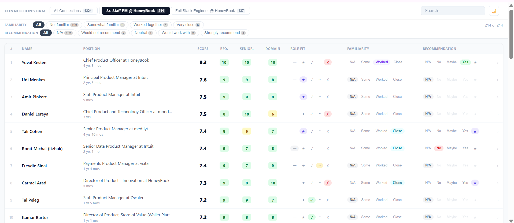

# ReferralFinder

Piotr and I created Leadjobs.dev after both of us experienced frustrating job searches - all the existing systems felt broken.

We both ended up finding our next jobs by referalls - which seems to be the strongest option right now.

So in parallel to continue improving leadjobs.dev, we decided to make referall finding as easy as possible for both sides.

This skill is the first part - helping people who already work, find referalls for open roles inside their company.

Super simple, free, and takes ~5 active minutes of your time (the rest is done by Claude).



---

## How it works

Say one thing to Claude:

> "I want to find who in my network to refer to this role: [paste job URL]"

Claude handles the flow: exporting LinkedIn data, enriching profiles, scoring candidates, and opening the CRM. You do not trigger steps manually or in any particular order.

---

## Prerequisites

- [Claude Code](https://claude.ai/code) installed and working
- [Python 3.9+](https://www.python.org/downloads/)

---

## Setup (one time)

**1.** Create a fresh folder on your computer.

**2.** Open Claude Code in that folder. Desktop app: File -> Open Folder.

**3.** Install ReferralFinder. Run this in the Claude Code terminal:

```bash
! npx skills add leadjobs-dev/ReferralFinder
```

**4.** Verify by asking Claude:

> "What can ReferralFinder do?"

Claude should describe the referral-finding flow. If not, restart Claude Code.

---

## The first run

Open Claude Code in your folder and say:

> "I want to find who in my network to refer to this role: [paste job URL]"

Here's what Claude guides you through:

**Step 1 - Export your LinkedIn connections** *(15-20 min wait)*

Claude explains exactly what to do in LinkedIn. The export email arrives in **15-20 minutes**. Claude waits until you confirm you have `Connections.csv` in hand before moving on.

**Step 2 - Connect Apify** *(~1 min)*

LinkedIn does not expose full work history directly, so Apify fetches it locally for ranking. Creating a free account takes about **10 seconds**.

**Step 3 - Enrichment runs** *(passive)*

Claude submits connections to Apify in 10-profile batches, up to 25 runs at a time, then merges the results after all batches finish. You do not need to do anything during this time.

> **Cost:** Apify's free tier ($5/month) covers about 1,250 profiles at the actor's current pricing.

**Step 4 - Scoring and CRM** *(~5 min)*

Claude scores relevant connections against the job requirements and opens the CRM at http://localhost:8765. Your connections are ranked by fit, with inline controls to mark familiarity and flag who you would refer.

---

## Using the CRM

The CRM is built for fast outreach review:

- Click the **LinkedIn icon** next to a candidate to copy their prepared message and open their LinkedIn profile.
- Click the small **check button** next to a candidate to mark them as contacted today without expanding the row.
- Use **Role fit**, **Familiarity**, and **Recommendation** chips inline as you review.
- Use **Tenure** filters to hide people who have been at their current company for less than 1, 2, or 3 years.
- Use **Outreach -> Not contacted** to hide people you have already contacted.
- Filters, search, sort, page, and selected role are stored in the URL, so refreshes and shared links reopen the same view.

Example:

```text
http://localhost:8765/?tab=ranked_seniorfullstackengin_20260523.json&fit=unset&tenure=1&outreach=not_contacted
```

---

## Subsequent runs

Already enriched your connections before? Use the same phrase. Claude skips to ranking and preserves all your notes.

To rank for a different role anytime:

> "Rank my connections for this job: [paste URL]"

---

## Your data

```text
your-folder/
|-- data/
|   |-- connections_index.json   # enriched profiles + all your annotations
|   |-- profiles/                # full profile details, loaded on demand
|   `-- ranked_*.json            # ranked results, one per role
```

Everything stays on your machine. Back up the `data/` folder occasionally.

---

## Updating

```bash
! npx skills add leadjobs-dev/ReferralFinder
```

Same command, updates in place.
